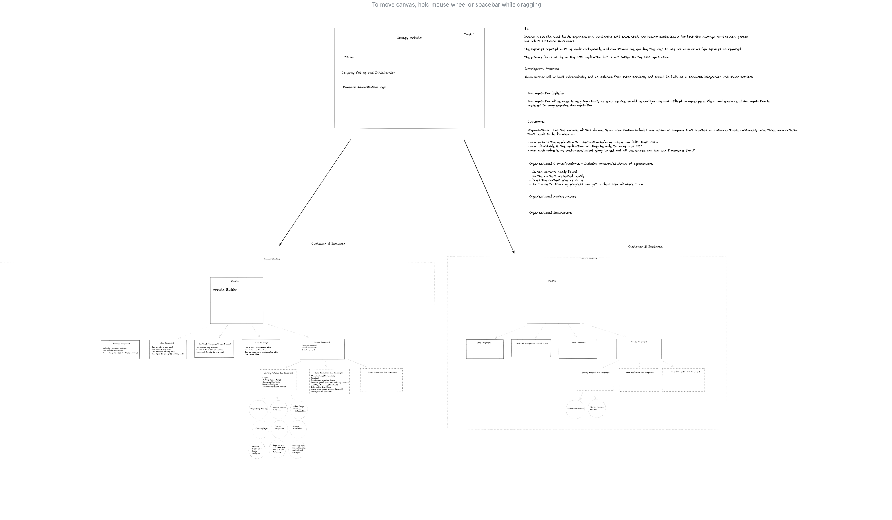

# Online Courses Website Plan

This application will be spread out into multiple services that will be able to be deployed in conjunction with each other.

The idea is to create a website that a user/business can use to create their own website/LMS instance with as many services as they require. The focus of this service will be on a whole package LMS.

The Services provided will include:

- Bookings Component
- Blog Component
- Contact Component (chat app)
- Shop Component
- Course Component
  - Learning material Sub Component
  - Quiz Application Sub Component
  - Social Connection Sub Component

